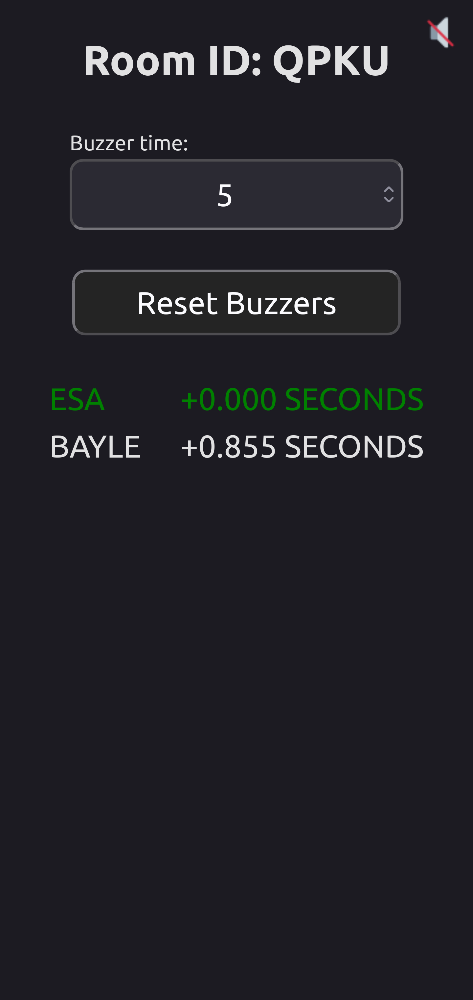
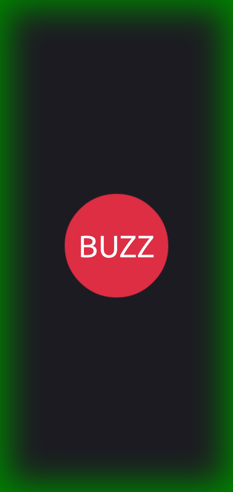

# Buzzer App

## Overview

Simple, easy to use application designed to play multi-team games that require buzz-in. Think Jeopardy or similar.

## Features

* Users can create or join rooms that can hold up to `n` players.
* Simple, intuitive interface for both hosts and players.
* Host room management:
    - buzz-in sounds
    - delayed secondary sound to enforce answer time limits
    - controlled, synchronized resets of buzzers to entire room

## Installation

Steps:
1. clone the repository with `git clone https://github.com/your-username/buzzer-app.git && cd buzzer-app`
2. install dependencies with `npm install` in both server and client application
3. run server and client applications with `npm run dev`
4. client should be running at `http://localhost:5173`. `hello world` from backend should be visible at `http://localhost:8080/`

## Screenshots

    <figure style="width: 21%; margin: 1%; text-align: center;">
        
        <figcaption>Home</figcaption>
    </figure>
    <figure style="width: 21%; margin: 1%; text-align: center;">
        
        <figcaption>Host</figcaption>
    </figure>
    <figure style="width: 21%; margin: 1%; text-align: center;">
        
        <figcaption>Join</figcaption>
    </figure>
    <figure style="width: 21%; margin: 1%; text-align: center;">
        
        <figcaption>Winner</figcaption>
    </figure>

